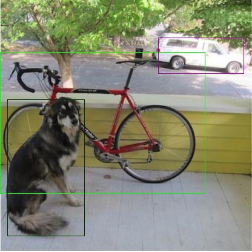

## What Is This?
This example shows you how to build a working **CPP-based** example that uses **onnxruntime** to run `yolov3-10.onnx` model file.

## Setup
Follow the instructions below to start building the example.
```bash
cd yolov3_ort_cpp_example
wget https://github.com/onnx/models/raw/master/vision/object_detection_segmentation/yolov3/model/yolov3-10.onnx
mkdir build && cd build
cmake ..
make
./yolov3
```

## Verify
You know it is working if this produces the following output in the terminal.
```txt
Start Loading Model yolov3-10.onnx

Result 1
Detected        : bicycle
Bounding Box    : (X, Y, W, H) = (169.03, 203.06, 340.61, 235.45)
Score           : 99.563683 %

Result 2
Detected        : truck
Bounding Box    : (X, Y, W, H) = (332.86, 92.03, 142.98, 61.44)
Score           : 97.519569 %

Result 3
Detected        : dog
Bounding Box    : (X, Y, W, H) = (76.96, 277.38, 128.82, 226.34)
Score           : 99.882484 %

Preprocessing Time: 685.745 msec
Postprocessing Time: 0.393 msec
Prediction Time: 125.269 msec

Written to [ output.jpg ].
Done!
```

It should also produce the following `output.jpg` image file as shown below:



## Acknowledgement
This code example is referenced from [hoaquochan/Yolo_v3](https://github.com/hoaquocphan/Yolo_v3).
